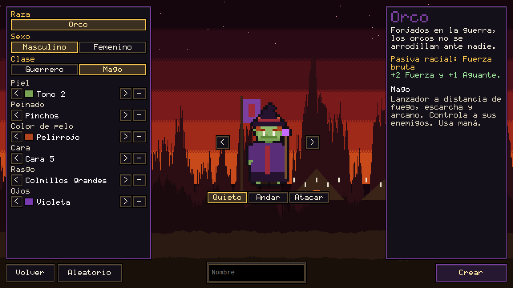
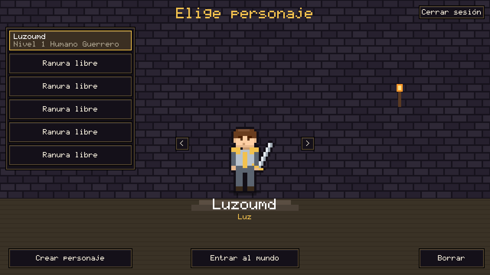
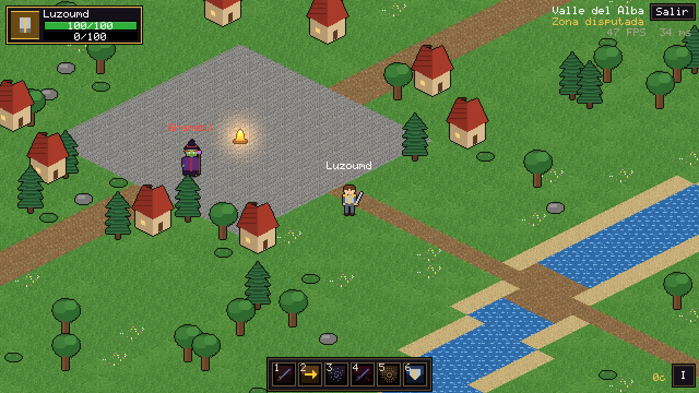
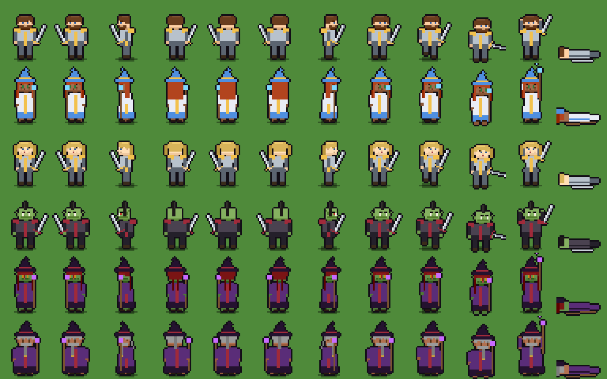

# Luz y Sombra (MMORPG 2D pixel art, web3 en NEAR)

MMORPG de acción con vista isométrica estilo Diablo, clases estilo MMO clásico y
dos facciones enfrentadas: la **Luz** y la **Sombra** (nombres provisionales,
editables en `shared/data/factions.ts`). Proyecto autónomo dentro de este repo:
tiene su propio `package.json`, sus tests y su build, y no toca el juego principal.

Estado: **Fase 2 terminada.** Sobre el MVP de la Fase 1 (servidor autoritativo, zona
isométrica, Guerrero y Mago, 3 enemigos, botín, multijugador) se añaden cuentas,
creador de personajes, sprites por capas con cambio de paleta, persistencia en
PostgreSQL y pantalla de selección de personajes.

| Creador de personajes | Selección | En el mundo |
|---|---|---|
|  |  |  |



## Cómo probarlo

Requisitos: Node 20 o superior y pnpm (o npm). PostgreSQL es opcional en desarrollo.

```bash
cd juego-web3
pnpm install

# Opción A, sin base de datos (cuentas y personajes en memoria, se borran al reiniciar):
npm run dev

# Opción B, con PostgreSQL 16 en Docker (persistencia real):
npm run db:up        # PostgreSQL en localhost:5434
npm run dev:pg       # servidor con DATABASE_URL + cliente
```

Abre `http://localhost:5180`:

1. **Crear cuenta** con usuario y contraseña (la sesión se recuerda en el navegador).
2. **Crear personaje**: elige facción (Luz o Sombra), y luego raza, sexo, clase,
   piel, peinado, color de pelo, cara, rasgo racial y ojos. Gira la vista previa con
   las flechas y prueba las animaciones Quieto, Andar y Atacar. **Aleatorio** cambia
   todo menos lo que bloquees con el botón de la derecha de cada fila.
3. **Entrar al mundo**. El botón **Salir** (arriba a la derecha) guarda y vuelve a la
   selección; al volver a entrar apareces donde lo dejaste, con tu oro y tu bolsa.

Para ver el multijugador, abre otra ventana de incógnito con otra cuenta: los
jugadores de la otra facción aparecen con el nombre en rojo.

| Acción | Control |
|---|---|
| Moverse | Clic izquierdo en el suelo (mantener pulsado para seguir el cursor), o WASD |
| Atacar | Clic izquierdo sobre un enemigo (te acercas solo y atacas en automático) |
| Recoger botín | Clic izquierdo sobre la bolsa (solo la tuya) |
| Habilidades | Teclas 1 a 6 o clic en la barra; clic derecho = habilidad 1 |
| Objetivo | Tab (siguiente enemigo cercano), Esc (quitar objetivo) |
| Bolsa | I o el botón de abajo a la derecha |

Otros comandos:

```bash
npm test             # tests (el contrato de PostgreSQL se omite sin TEST_DATABASE_URL)
npm run test:pg      # tests incluyendo PostgreSQL (tras npm run db:up)
npm run typecheck    # tsc --noEmit
npm run build        # build de produccion del cliente en dist/client
DATABASE_URL=... npm start   # produccion: sirve dist/client, la API y el juego en :8790
npm run map          # regenera maps/valle_alba.tmj (abrible y editable en Tiled)
```

## Estructura de carpetas

```
juego-web3/
├── shared/                 Código común cliente + servidor (sin DOM, sin Node)
│   ├── constants.ts        Tick 20 Hz, resolución 640x360, tamaño de baldosa, AOI...
│   ├── iso.ts              Proyección isométrica y 8 direcciones
│   ├── rng.ts              Aleatorio con semilla (nunca Math.random en la lógica)
│   ├── map.ts / tiles.ts   Lectura de mapas Tiled (.tmj) y catálogo de baldosas
│   ├── pathfinding.ts      A* de 8 vecinos + suavizado + línea de visión
│   ├── combat.ts           Fórmulas clásicas: armadura, ira, tabla de golpes, regeneración
│   ├── money.ts            Cobre / plata / oro
│   ├── names.ts            Validación de nombres (cliente y servidor)
│   ├── appearance.ts       Apariencia como IDs compactos: validación, aleatorio, red
│   ├── protocol.ts         Mensajes cliente <-> servidor
│   ├── validate.ts         Validación estricta de mensajes entrantes
│   └── data/               TODO el contenido como datos: facciones, razas y opciones
│                           de apariencia, clases, habilidades, auras, enemigos, objetos, zonas
├── server/
│   ├── main.ts             Arranca un proceso de zona (PostgreSQL con DATABASE_URL, si no memoria)
│   ├── app.ts              Monta API REST + WebSocket + autoguardado cada 30 s
│   ├── auth/               Contraseñas con scrypt, tokens de sesión (solo se guarda su hash)
│   ├── characters/         Creación/listado/borrado y registro de conectados (sin doble sesión)
│   ├── db/                 Contrato Store + PgStore (esquema idempotente) + MemoryStore
│   ├── http/               Enrutador REST, límite de peticiones por IP y rutas /api
│   ├── net/                HTTP + WebSocket, sesión por conexión (validación y límite de mensajes)
│   └── zone/               Simulación autoritativa de la zona
│       ├── zone.ts         Bucle de 20 Hz, movimiento, muerte, proyectiles, botín
│       ├── player.ts       Órdenes del jugador (mover, atacar, lanzar, recoger) y regeneración
│       ├── abilities.ts    Validación y resolución de habilidades (coste, alcance, CD, efectos)
│       ├── combat.ts       Daño, curación, amenaza, auras
│       ├── ai.ts           IA de enemigos: reposo, combate por arquetipo, evasión
│       ├── grid.ts         Rejilla espacial por celdas (AOI y proximidad)
│       └── interest.ts     Instantáneas por área de interés (altas, bajas y cambios)
├── client/
│   ├── main.ts             Entrada: inicio de sesión y Phaser con escalado entero
│   ├── enter_world.ts      Conecta un personaje a su zona y arranca mundo + HUD
│   ├── net/                API REST, WebSocket con ping y espejo del mundo (interpolación + predicción)
│   ├── scenes/             Arranque, selección, creador, mundo (mapa por trozos, entidades, efectos)
│   ├── ui/                 HUD pixel art: marcos, barra de acción, tooltips, bolsa
│   ├── gfx/                Arte procedural: pose común, enemigos, baldosas, iconos, fuente, fondos
│   │   └── paperdoll/      Personajes por capas: capas, paleta (palette swap) y compositor
│   └── i18n.ts             Todos los textos de la interfaz
├── maps/valle_alba.tmj     Zona inicial (Tiled, isométrica, 96x96)
├── scripts/                Generador del mapa de placeholder
└── tests/                  Vitest: shared, zona, integración WebSocket
```

La carpeta `contracts/` (Rust + near-sdk) llegará en la Fase 7. Redis (sesiones,
chat, caché de saldos) entra cuando haya varios procesos de zona (Fase 3 y 4); hasta
entonces las sesiones viven en PostgreSQL.

## Arquitectura

```
 Navegador (Phaser)                         Proceso de zona (Node)
 ┌──────────────────────────┐   intenciones  ┌────────────────────────────────┐
 │ Entrada estilo Diablo    │ ─────────────▶ │ Session: valida, limita, encola│
 │  move / attack / cast /  │   (JSON, WS)   │                                │
 │  pickup / target         │                │ Zone.step() a 20 Hz:           │
 │                          │                │  1. procesa la cola de órdenes │
 │ ClientWorld (espejo)     │ ◀───────────── │  2. jugadores, IA, auras,      │
 │  - interpola remotos     │  instantáneas  │     lanzamientos, proyectiles  │
 │    100 ms en el pasado   │  por AOI       │  3. muerte, botín, respawn     │
 │  - predice tu movimiento │  (altas, bajas │  4. instantánea por jugador    │
 │    con el mismo A*       │   y cambios)   │     solo con lo que cambió     │
 └──────────────────────────┘                └────────────────────────────────┘
              ▲                                           ▲
              └──────────── shared/ (datos, fórmulas, A*, mapa, protocolo) ───┘
```

Principios:

- **El servidor es la autoridad.** El cliente solo envía intenciones. Movimiento,
  alcance, línea de visión, costes, reutilizaciones, daño, botín y oro se deciden
  en el servidor. Una prueba lo garantiza para el botín: recogerlo solo traslada
  el cobre exacto que soltó el enemigo, y solo a su dueño.
- **Una sola lógica compartida.** Cliente y servidor leen el mismo mapa y usan el
  mismo A*, así que la predicción del movimiento propio casi nunca necesita
  corrección. Si el servidor discrepa, la posición se corrige suavemente (o de
  golpe si el error es grande).
- **Determinismo.** Paso fijo de 20 Hz y aleatoriedad con semilla: misma semilla y
  mismas órdenes dan el mismo resultado (hay una prueba).
- **Área de interés por celdas.** Cada jugador solo recibe las entidades de las
  celdas de 16x16 baldosas que le rodean, y de esas solo las que cambiaron. La
  apariencia viaja como IDs compactos (clase, facción, tipo de enemigo).
- **Contenido como datos.** Clases, habilidades, auras, enemigos, objetos, zonas y
  facciones están en `shared/data/`. Añadir un enemigo o una habilidad no requiere
  tocar la lógica.
- **Personajes por capas (paper doll) con cambio de paleta.** Rejilla común:
  8 direcciones x (Idle 4, Walk 6, Attack 4, Cast 4, Hit 2, Death 4) fotogramas de
  32x40. Capas: cuerpo (por raza y sexo), cara, equipo de la clase, rasgo racial,
  pelo, tocado y arma. Todas se dibujan desde la misma geometría por fotograma
  (`client/gfx/paperdoll/layers.ts`), así que encajan en cualquier dirección.
  Piel, pelo y ojos se pintan con colores clave y se sustituyen con una tabla
  (`palette.ts`): un peinado sirve para los 16 colores de pelo sin una hoja por
  combinación. Cada capa se dibuja una vez (caché LRU) y cada personaje se compone
  en UNA textura cacheada con contador de referencias. Por la red solo viajan 8
  números (`AppearanceWire`).
- **Arte reemplazable.** Todo el arte es placeholder generado por código; una hoja
  real con la misma rejilla y clave lo sustituye sin tocar la lógica.
- **Cuentas y persistencia.** Contraseñas con scrypt; el token de sesión es opaco y
  en la base de datos solo se guarda su hash. La facción la decide el servidor a
  partir de la raza. El servidor guarda posición, oro y bolsa al salir y cada 30 s;
  al reconectar espera a que termine el guardado anterior y un personaje no puede
  estar conectado dos veces (sin pérdida ni duplicación de oro). El esquema de
  PostgreSQL se aplica de forma idempotente al arrancar y el oro tiene
  `CHECK (oro >= 0)`.
- **Pixel art nítido.** Resolución base 640x360, `pixelArt: true`, cámara en
  píxeles enteros y zoom entero (x1, x2, x3...) que llena la ventana sin bandas.
- **Rendimiento.** El suelo se pinta una vez por trozo de 16x16 baldosas en una
  RenderTexture y solo se muestran los trozos visibles; las vistas de entidades y
  los números flotantes salen de pools; las entidades fuera de cámara no se dibujan.

## Contenido

- **Razas (Fase 2)**: Humanos (Luz, pasiva "Voluntad firme": +2 Espíritu, +1 Intelecto)
  y Orcos (Sombra, "Fuerza bruta": +2 Fuerza, +1 Aguante). Cada raza: 10 tonos de
  piel, 10 u 11 peinados por sexo (de un catálogo de 15), 16 colores de pelo, 6 caras,
  8 colores de ojos y rasgos raciales (barbas, pecas, cicatriz, colmillos, pintura
  de guerra, aro). Silueta propia por raza (los orcos son más corpulentos y tienen
  orejas puntiagudas) y por sexo.

- **Guerrero** (ira; se genera al golpear y al recibir daño): Tajo brutal, Carga
  (aturde 1 s), Torbellino, Tajo al tendón (ralentiza), Grito de guerra, Defensa férrea.
- **Mago** (maná con la regla de los 5 segundos): Bola de fuego (proyectil + quemadura),
  Descarga de escarcha (ralentiza), Nova de escarcha (congela), Explosión arcana,
  Parpadeo (no atraviesa muros, rompe raíces), Armadura de escarcha.
- **Enemigos**: Lobo gris (bestia, cuerpo a cuerpo, avisa a la manada), Esqueleto
  arquero (no-muerto, dispara y se aleja si te acercas), Cultista del vacío
  (lanzador, cura a aliados heridos). Todos tienen amenaza, correa (vuelven a casa
  curados si los alejas demasiado) y reaparición.
- **Botín**: cobre y objetos por tabla de probabilidades, con dueño; bolsa de 16 huecos
  con pilas de 20 y tooltips por rareza.

## Plan de fases

1. **MVP** (hecho).
2. **Creador de personajes, paper doll con cambio de paleta, persistencia, cuentas y
   selección** (hecho).
3. Inventario y equipo visible, misiones, niveles, ciudad central neutral y portales.
4. Las 8 razas y sus zonas iniciales, las 9 clases con talentos, grupos y chat por facción.
5. Primera mazmorra de 5 jugadores y buscador de grupo.
6. Comercio, casa de subastas neutral, profesiones, barbería y libro contable de oro.
7. Web3 en testnet: contrato NEP-141, wallet, vinculación por firma NEP-413, claim
   unidireccional (juego a cadena), límites y antiabuso.
8. Rangos de holder y cosméticos (solo visuales, nunca poder).
9. JcJ Luz contra Sombra.
10. Banda, hermandades, optimización, pruebas de carga y preparación para mainnet.
