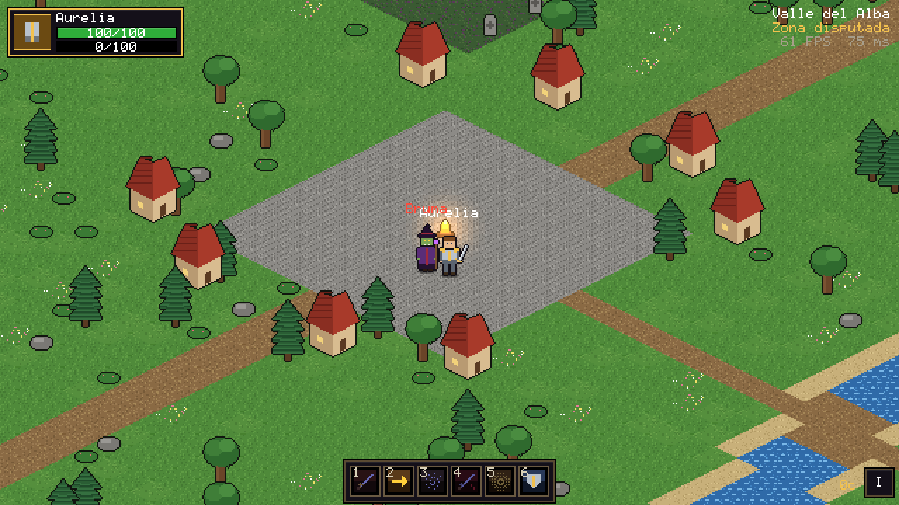
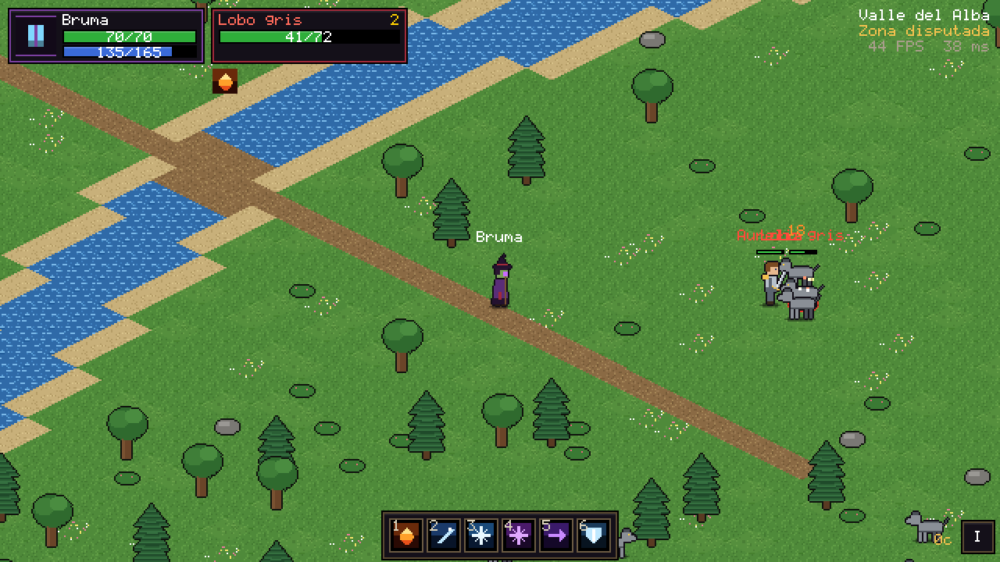
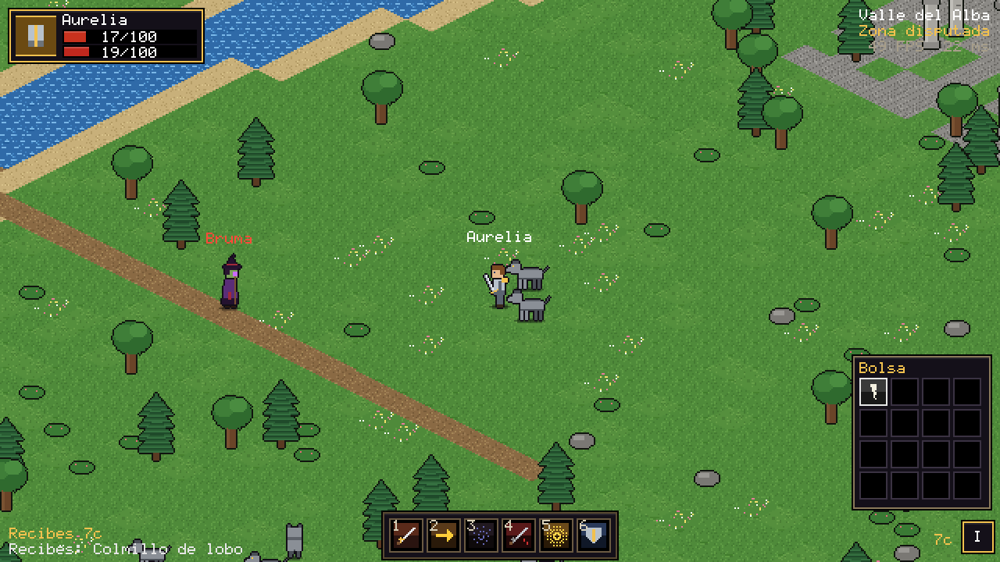

# Luz y Sombra (MMORPG 2D pixel art, web3 en NEAR)

MMORPG de acción con vista isométrica estilo Diablo, clases estilo MMO clásico y
dos facciones enfrentadas: la **Luz** y la **Sombra** (nombres provisionales,
editables en `shared/data/factions.ts`). Proyecto autónomo dentro de este repo:
tiene su propio `package.json`, sus tests y su build, y no toca el juego principal.

Estado: **Fase 1 (MVP) terminada.** Servidor autoritativo + cliente Phaser, una
zona inicial en tilemap isométrico de Tiled, movimiento con clic, Guerrero y Mago,
3 tipos de enemigos con IA distinta, botín básico y varios jugadores viéndose en
tiempo real.

| Aldea inicial | Combate (maga de la Sombra) | Botín y bolsa |
|---|---|---|
|  |  |  |

## Cómo probarlo

Requisitos: Node 20 o superior y pnpm (o npm).

```bash
cd juego-web3
pnpm install          # o: npm install
npm run dev           # servidor de zona en :8790 + cliente Vite en :5180
```

Abre `http://localhost:5180`, elige nombre, facción y clase y pulsa **Entrar al
mundo**. Para ver el multijugador abre una segunda pestaña (o ventana de
incógnito) con otro nombre: cada jugador ve moverse y combatir al otro en tiempo
real. Los jugadores de la otra facción aparecen con el nombre en rojo.

| Acción | Control |
|---|---|
| Moverse | Clic izquierdo en el suelo (mantener pulsado para seguir el cursor), o WASD |
| Atacar | Clic izquierdo sobre un enemigo (te acercas solo y atacas en automático) |
| Recoger botín | Clic izquierdo sobre la bolsa (solo la tuya: la del primero que golpeó al enemigo) |
| Habilidades | Teclas 1 a 6 o clic en la barra; clic derecho = habilidad 1 |
| Objetivo | Tab (siguiente enemigo cercano), Esc (quitar objetivo) |
| Bolsa | I o el botón de abajo a la derecha |

Ruta recomendada: desde la aldea, sigue el camino hacia el este y cruza el puente
central. Hay lobos en la pradera (cuerpo a cuerpo, en manada), esqueletos arqueros
en las ruinas del norte (mantienen la distancia) y cultistas en el campamento del
sur (lanzan descargas de sombra y se curan entre ellos).

Otros comandos:

```bash
npm test             # 36 tests: formulas, A*, zona autoritativa, WebSocket real
npm run typecheck    # tsc --noEmit
npm run build        # build de produccion del cliente en dist/client
npm start            # servidor de produccion: sirve dist/client y el juego en :8790
npm run map          # regenera maps/valle_alba.tmj (abrible y editable en Tiled)
```

## Estructura de carpetas

```
juego-web3/
├── shared/                 Código común cliente + servidor (sin DOM, sin Node)
│   ├── constants.ts        Tick 20 Hz, resolución 640x360, tamaño de baldosa, AOI...
│   ├── iso.ts              Proyección isométrica y 8 direcciones
│   ├── rng.ts              Aleatorio con semilla (nunca Math.random en la lógica)
│   ├── map.ts / tiles.ts   Lectura de mapas Tiled (.tmj) y catálogo de baldosas
│   ├── pathfinding.ts      A* de 8 vecinos + suavizado + línea de visión
│   ├── combat.ts           Fórmulas clásicas: armadura, ira, tabla de golpes, regeneración
│   ├── money.ts            Cobre / plata / oro
│   ├── names.ts            Validación de nombres (cliente y servidor)
│   ├── protocol.ts         Mensajes cliente <-> servidor
│   ├── validate.ts         Validación estricta de mensajes entrantes
│   └── data/               TODO el contenido como datos: facciones, clases,
│                           habilidades, auras, enemigos, objetos, zonas
├── server/
│   ├── main.ts             Arranca un proceso de zona
│   ├── net/                HTTP + WebSocket, sesión por conexión (validación y límite de mensajes)
│   └── zone/               Simulación autoritativa de la zona
│       ├── zone.ts         Bucle de 20 Hz, movimiento, muerte, proyectiles, botín
│       ├── player.ts       Órdenes del jugador (mover, atacar, lanzar, recoger) y regeneración
│       ├── abilities.ts    Validación y resolución de habilidades (coste, alcance, CD, efectos)
│       ├── combat.ts       Daño, curación, amenaza, auras
│       ├── ai.ts           IA de enemigos: reposo, combate por arquetipo, evasión
│       ├── grid.ts         Rejilla espacial por celdas (AOI y proximidad)
│       └── interest.ts     Instantáneas por área de interés (altas, bajas y cambios)
├── client/
│   ├── main.ts             Entrada: formulario, conexión y Phaser con escalado entero
│   ├── net/                WebSocket con ping y espejo del mundo (interpolación + predicción)
│   ├── scenes/             Arranque, mundo (mapa por trozos, entidades, entrada, efectos)
│   ├── ui/                 HUD pixel art: marcos, barra de acción, tooltips, bolsa
│   ├── gfx/                Arte procedural: personajes por capas, baldosas, iconos, fuente
│   └── i18n.ts             Todos los textos de la interfaz
├── maps/valle_alba.tmj     Zona inicial (Tiled, isométrica, 96x96)
├── scripts/                Generador del mapa de placeholder
└── tests/                  Vitest: shared, zona, integración WebSocket
```

La carpeta `contracts/` (Rust + near-sdk) llegará en la Fase 7.

## Arquitectura

```
 Navegador (Phaser)                         Proceso de zona (Node)
 ┌──────────────────────────┐   intenciones  ┌────────────────────────────────┐
 │ Entrada estilo Diablo    │ ─────────────▶ │ Session: valida, limita, encola│
 │  move / attack / cast /  │   (JSON, WS)   │                                │
 │  pickup / target         │                │ Zone.step() a 20 Hz:           │
 │                          │                │  1. procesa la cola de órdenes │
 │ ClientWorld (espejo)     │ ◀───────────── │  2. jugadores, IA, auras,      │
 │  - interpola remotos     │  instantáneas  │     lanzamientos, proyectiles  │
 │    100 ms en el pasado   │  por AOI       │  3. muerte, botín, respawn     │
 │  - predice tu movimiento │  (altas, bajas │  4. instantánea por jugador    │
 │    con el mismo A*       │   y cambios)   │     solo con lo que cambió     │
 └──────────────────────────┘                └────────────────────────────────┘
              ▲                                           ▲
              └──────────── shared/ (datos, fórmulas, A*, mapa, protocolo) ───┘
```

Principios:

- **El servidor es la autoridad.** El cliente solo envía intenciones. Movimiento,
  alcance, línea de visión, costes, reutilizaciones, daño, botín y oro se deciden
  en el servidor. Una prueba lo garantiza para el botín: recogerlo solo traslada
  el cobre exacto que soltó el enemigo, y solo a su dueño.
- **Una sola lógica compartida.** Cliente y servidor leen el mismo mapa y usan el
  mismo A*, así que la predicción del movimiento propio casi nunca necesita
  corrección. Si el servidor discrepa, la posición se corrige suavemente (o de
  golpe si el error es grande).
- **Determinismo.** Paso fijo de 20 Hz y aleatoriedad con semilla: misma semilla y
  mismas órdenes dan el mismo resultado (hay una prueba).
- **Área de interés por celdas.** Cada jugador solo recibe las entidades de las
  celdas de 16x16 baldosas que le rodean, y de esas solo las que cambiaron. La
  apariencia viaja como IDs compactos (clase, facción, tipo de enemigo).
- **Contenido como datos.** Clases, habilidades, auras, enemigos, objetos, zonas y
  facciones están en `shared/data/`. Añadir un enemigo o una habilidad no requiere
  tocar la lógica.
- **Arte reemplazable.** Todos los sprites son placeholders generados por código con
  la rejilla definitiva: 8 direcciones x (Idle 4, Walk 6, Attack 4, Cast 4, Hit 2,
  Death 4) fotogramas de 32x40. Los personajes se dibujan por capas (sombra,
  piernas, torso, cabeza, pelo/sombrero, arma) a partir de una pose común por
  fotograma, así que todas las capas quedan alineadas. Cargar una hoja real con la
  misma clave de textura sustituye al placeholder sin tocar la lógica.
- **Pixel art nítido.** Resolución base 640x360, `pixelArt: true`, cámara en
  píxeles enteros y zoom entero (x1, x2, x3...) que llena la ventana sin bandas.
- **Rendimiento.** El suelo se pinta una vez por trozo de 16x16 baldosas en una
  RenderTexture y solo se muestran los trozos visibles; las vistas de entidades y
  los números flotantes salen de pools; las entidades fuera de cámara no se dibujan.

## Contenido de la Fase 1

- **Guerrero** (ira; se genera al golpear y al recibir daño): Tajo brutal, Carga
  (aturde 1 s), Torbellino, Tajo al tendón (ralentiza), Grito de guerra, Defensa férrea.
- **Mago** (maná con la regla de los 5 segundos): Bola de fuego (proyectil + quemadura),
  Descarga de escarcha (ralentiza), Nova de escarcha (congela), Explosión arcana,
  Parpadeo (no atraviesa muros, rompe raíces), Armadura de escarcha.
- **Enemigos**: Lobo gris (bestia, cuerpo a cuerpo, avisa a la manada), Esqueleto
  arquero (no-muerto, dispara y se aleja si te acercas), Cultista del vacío
  (lanzador, cura a aliados heridos). Todos tienen amenaza, correa (vuelven a casa
  curados si los alejas demasiado) y reaparición.
- **Botín**: cobre y objetos por tabla de probabilidades, con dueño; bolsa de 16 huecos
  con pilas de 20 y tooltips por rareza.

## Plan de fases

1. **MVP** (hecho).
2. Creador de personajes (1 raza por facción, ambos sexos, piel, peinados, color de
   pelo), paper doll con palette swap, persistencia en PostgreSQL, cuentas y selección
   de personajes.
3. Inventario y equipo visible, misiones, niveles, ciudad central neutral y portales.
4. Las 8 razas y sus zonas iniciales, las 9 clases con talentos, grupos y chat por facción.
5. Primera mazmorra de 5 jugadores y buscador de grupo.
6. Comercio, casa de subastas neutral, profesiones, barbería y libro contable de oro.
7. Web3 en testnet: contrato NEP-141, wallet, vinculación por firma NEP-413, claim
   unidireccional (juego a cadena), límites y antiabuso.
8. Rangos de holder y cosméticos (solo visuales, nunca poder).
9. JcJ Luz contra Sombra.
10. Banda, hermandades, optimización, pruebas de carga y preparación para mainnet.
